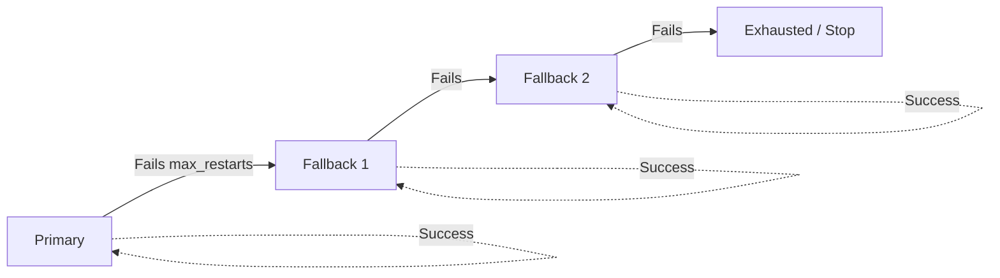

# crew

**When Claude rate-limits, automatically switch to Gemini. When that fails, run your own script.**

> Adversarial Multi-Agent Orchestration Tool for AI-assisted development

> **WARNING**: This tool launches AI agents that run with **full access to your codebase and system**.
> Agents can read, create, modify, and delete files autonomously. By default, agents run with
> `--dangerously-skip-permissions`, which bypasses all safety prompts. **Review your agent prompts
> and configuration before running `crew start`.** See [SECURITY.md](SECURITY.md) for details.

## Overview

`crew` provides two distinct modes for AI agent orchestration:

| Command | Mode | Use Case |
|---------|------|----------|
| `design` | Design-Review | Refine ideas into polished design docs |
| `crew` | Parallel Agents | Run multiple AI agents for debugging/optimization |

## Installation

### Homebrew (macOS) — recommended

```bash
brew tap garnetlyx/crew
brew install crew
```

To uninstall:

```bash
brew uninstall crew
brew untap garnetlyx/crew
```

### From Source

```bash
git clone https://github.com/garnetlyx/crew ~/dev/crew
cd ~/dev/crew
./install.sh
```

This creates symlinks in `~/.local/bin`. If not already in PATH, add to your shell config:

```bash
export PATH="$HOME/.local/bin:$PATH"
```

To uninstall:

```bash
cd ~/dev/crew
./uninstall.sh
```

Requires:
- Bash 4+
- `yq` for YAML parsing: `brew install yq`
- An AI CLI: `claude`, `codex`, `opencode`, `gemini`, or `aider`

Supported platforms:
- **macOS** (primary, actively developed)
- **Linux** (tested)
- **Windows WSL** (untested, should work)

## First-time Setup Security Checklist

Before running `crew start`, verify the following:

- [ ] **Git clean state** — commit or stash all work; agents will modify files
- [ ] **Review prompts** — read every file in `.crew/prompts/` before agents use them
- [ ] **Review `crew.yaml`** — confirm each agent's `command` and `env` fields look correct
- [ ] **No secrets in config** — API keys go in shell env (`export ANTHROPIC_API_KEY=...`), never in `crew.yaml`
- [ ] **`.gitignore` covers runtime files** — `.crew/logs/`, `.crew/run/` should be ignored
- [ ] **Understand `--dangerously-skip-permissions`** — agents bypass all safety prompts and can read/write/delete any file

> **Tip**: Run `crew validate` to check config syntax before starting agents.

## `design` - Design-Review Mode

Turn ideas into refined design documents through automated Writer ⇄ Reviewer loops.

```bash
# Initialize with your idea
design init "A CLI tool for managing container deployments"

# Start design-review loop
design review

# Check status
design status
```

### How it works

```
┌──────────────┐    trigger     ┌──────────────┐
│ Plan Writer  │ ──────────────→│   Reviewer   │
│    Agent     │                │    Agent     │
└──────────────┘                └──────────────┘
       ↑                               │
       │ trigger (if !pass)            │ pass?
       └───────────────────────────────┘
```

### Termination Conditions

- **pass**: Reviewer approves the plan
- **stale**: Plan unchanged for 2 iterations
- **conflict**: Same issues repeat 3+ times

### Files

```
.design/
├── design.yaml     # Config
├── idea.txt        # Your initial idea
├── plan.md         # Current plan
├── review.md       # Current review
└── history/        # All iterations
```

## `crew` - Parallel Agents Mode

Run multiple AI agents in parallel for continuous codebase improvement.

```bash
# Initialize in your project
crew init

# Start all agents
crew start

# Start specific agents
crew start QA DEV JANITOR

# Monitor real-time
crew monitor

# View logs
crew logs QA

> **Tip**: For long-running tasks (like full test suites), log output may appear "stuck" due to buffering. The log will update in a large chunk once the command completes.

# Stop all
crew stop
```

### Configuration

Edit `.crew/crew.yaml`:

```yaml
project: my-project
check_interval: 30

agents:
  - name: QA
    icon: 🔴
    type: claude
    prompt: prompts/qa.txt
    interval: 10
    timeout: 600

  - name: DEV
    icon: 🔵
    type: claude
    prompt: prompts/dev.txt

  - name: JANITOR
    icon: 🟢
    type: claude
    prompt: prompts/janitor.txt
    interval: 10
    timeout: 600

> **Note**: Changes to `crew.yaml` (including `interval` and `env` variables) require a restart of the affected agents to take effect. Run `crew restart [AGENT]` to apply changes.
```

### JSON Config Alternative

If you prefer JSON over YAML, create `.crew/crew.json` instead. The JSON format uses `python3` (built-in `json` module, no pip install needed) and supports the same fields:

```json
{
  "project": "my-project",
  "check_interval": 30,
  "agents": [
    {
      "name": "QA",
      "type": "claude",
      "prompt": "prompts/qa.md",
      "interval": 10,
      "timeout": 600
    }
  ]
}
```

YAML takes priority when both `.crew/crew.yaml` and `.crew/crew.json` exist. JSON config requires `python3` to be available.

### Workflow Templates

Get started quickly with preset configurations:

```bash
# List available templates
crew init --list-templates

# Initialize with a template
crew init --template code-review
```

| Template | Agents | Use Case |
|----------|--------|----------|
| `code-review` | QA + DEV | Adversarial testing and bug fixing |
| `refactor` | DEV + JANITOR | Code improvement with doc maintenance |
| `security-audit` | QA + DEV | Vulnerability probing and patching |
| `docs` | DEV + JANITOR | Documentation writing and consistency |
| `full` | QA + DEV + JANITOR | All agents running together |

### Files

```
.crew/
├── crew.yaml       # Config
├── prompts/        # Agent prompts
├── logs/           # Agent logs
└── run/            # PID files
```

## CLI Plugins

crew uses a plugin system for CLI abstraction. Each supported CLI has a plugin that handles prompt delivery and execution.

### Built-in Plugins

| Plugin | CLI | Install |
|--------|-----|---------|
| `claude` | Claude Code | `npm install -g @anthropic-ai/claude-code` |
| `codex` | OpenAI Codex (latest) | `npm install -g @openai/codex` |
| `codex_legacy` | OpenAI Codex v0.80.0 | See [dual-version setup](#codex-with-3rd-party-models) |
| `opencode` | OpenCode | `go install github.com/opencode-ai/opencode@latest` |
| `gemini` | Google Gemini | `pip install google-gemini-cli` |
| `aider` | Aider | `pip install aider-chat` |

List installed plugins:

```bash
crew plugins
```

### Custom Plugins

Create a `.sh` file in `.crew/cli.d/` (project-local) or `~/.crew/cli.d/` (global):

```bash
#!/bin/bash
# .crew/cli.d/myagent.sh

cli_myagent_check() {
  command_exists myagent
}

cli_myagent_run() {
  local prompt_file="$1"
  local working_dir="$2"
  (cd "$working_dir" && myagent --auto < "$prompt_file")
}

cli_myagent_run_prompt() {
  local prompt="$1"
  local working_dir="$2"
  (cd "$working_dir" && echo "$prompt" | myagent --auto)
}
```

Then use `type: myagent` in `crew.yaml`.

## 3rd Party / Self-Hosted Models

Use the `env` field in `.crew/crew.yaml` to configure per-agent environment variables for different providers:

```yaml
agents:
  - name: DEV
    type: claude
    prompt: prompts/dev.md
    env:
      ANTHROPIC_BASE_URL: https://openrouter.ai/api/v1
      ANTHROPIC_MODEL: anthropic/claude-sonnet-4-20250514
```

### Common Providers

| Provider | `ANTHROPIC_BASE_URL` |
|----------|---------------------|
| Anthropic (default) | `https://api.anthropic.com` |
| OpenRouter | `https://openrouter.ai/api/v1` |
| Self-hosted | `http://localhost:8080/v1` |

### Codex with 3rd Party Models

> **IMPORTANT**: Codex CLI v0.105.0+ dropped `wire_api = "chat"` support, which is required by most third-party OpenAI-compatible providers. Use the built-in `codex_legacy` plugin (Codex v0.80.0) when working with non-OpenAI models.

#### Dual-Version Setup

Install both the latest codex and the legacy version side-by-side:

```bash
# Install latest codex (global default)
npm install -g @openai/codex@latest

# Install v0.80.0 to a separate prefix
npm install -g @openai/codex@0.80.0 --prefix ~/.codex-legacy
mkdir -p ~/.local/bin
ln -sf ~/.codex-legacy/bin/codex ~/.local/bin/codex-legacy
```

Verify both versions:

```bash
codex --version         # latest (e.g. 0.111.0)
codex-legacy --version  # 0.80.0
```

#### Plugin Differences

| Plugin | Binary | Default `wire_api` | Use Case |
|--------|--------|--------------------|----------|
| `codex` | `codex` (latest) | `responses` | OpenAI native models |
| `codex_legacy` | `codex-legacy` (v0.80.0) | `chat` | Third-party OpenAI-compatible providers |

Both plugins support the same `CODEX_*` environment variables:

| Variable | Description | Example |
|----------|-------------|---------|
| `CODEX_MODEL` | Model name | `qwen3.5-plus` |
| `CODEX_PROVIDER` | Provider identifier | `dashscope` |
| `CODEX_PROVIDER_NAME` | Human-readable name (defaults to `CODEX_PROVIDER`) | `DashScope` |
| `CODEX_BASE_URL` | Provider API base URL | `https://coding.dashscope.aliyuncs.com/v1` |
| `CODEX_WIRE_API` | Wire protocol: `chat` or `responses` | `chat` |
| `CODEX_API_KEY_ENV` | Env var name holding the API key (default: `OPENAI_API_KEY`) | `OPENAI_API_KEY` |

#### Example: Latest Codex with OpenAI, Legacy Fallback to 3rd Party

```yaml
agents:
  - name: DEV
    type: codex              # latest codex for OpenAI models
    prompt: prompts/dev.md
    env:
      OPENAI_API_KEY: ${OPENAI_API_KEY}
    fallback:
      - label: dashscope
        type: codex_legacy   # v0.80.0 with wire_api=chat
        env:
          CODEX_MODEL: qwen3.5-plus
          CODEX_PROVIDER: dashscope
          CODEX_BASE_URL: https://coding.dashscope.aliyuncs.com/v1
          OPENAI_API_KEY: ${QWC_API_KEY}
      - label: minimax
        type: codex_legacy
        env:
          CODEX_MODEL: MiniMax-M2.5
          CODEX_PROVIDER: minimax
          CODEX_BASE_URL: https://api.minimaxi.com/v1
          OPENAI_API_KEY: ${MINIMAX_API_KEY}
```

#### Example: Legacy Codex Only (3rd Party Models)

```yaml
agents:
  - name: DEV
    type: codex_legacy
    prompt: prompts/dev.md
    env:
      CODEX_MODEL: qwen3.5-plus
      CODEX_PROVIDER: dashscope
      CODEX_BASE_URL: https://coding.dashscope.aliyuncs.com/v1
      CODEX_WIRE_API: chat
      OPENAI_API_KEY: ${QWC_API_KEY}
    fallback:
      - label: minimax
        type: codex_legacy
        env:
          CODEX_MODEL: MiniMax-M2.5
          CODEX_PROVIDER: minimax
          CODEX_BASE_URL: https://api.minimaxi.com/v1
          CODEX_WIRE_API: chat
          OPENAI_API_KEY: ${MINIMAX_API_KEY}
```

### API Key Handling

> **WARNING**: Never put API keys in `crew.yaml` if it's committed to git.

Set API keys in `.crew/.env` (git-ignored) or your shell environment:

```bash
export ANTHROPIC_API_KEY="sk-..."
export OPENAI_API_KEY="sk-..."
```

### Shared Configuration

Multiple projects can share configuration files. `crew` searches in the following order, with local settings taking the highest priority:

#### Config files (`crew.yaml` / `design.yaml`)

The **first** config file found is used (no merging):

1.  **Local**: `.crew/crew.yaml` in the current directory
2.  **Parent**: `.crew/crew.yaml` in any parent directory (recursive)
3.  **Global**: `~/.crew/crew.yaml`

This means you can put a shared `crew.yaml` in `~/dev/.crew/crew.yaml` and all projects under `~/dev/` will inherit it, unless they have their own `.crew/crew.yaml`.

#### Environment files (`.env`)

`.env` files are **merged** (all levels stack):

1.  **Global**: `~/.crew/.env`
2.  **Parent**: `.crew/.env` or `.design/.env` in any parent directory (recursive)
3.  **Local**: `.crew/.env` or `.design/.env` in the current project

Values are merged, with local project settings taking the highest priority.

## Fallback Mechanism

When an agent fails repeatedly (reaching `max_restarts`), it automatically falls back to the next level in its fallback chain. Each level can change the CLI type, env vars, or both.

### How It Works



- Each level retries up to its `max_restarts` (default: 5) with exponential backoff
- On success, the agent **stays at that level** (does not revert to primary)
- After all levels are exhausted, the agent stops (`.crew/run/<name>.exhausted`)
- Fallback-level `env` vars are **merged on top** of agent-level env — only override what changes
- Use `crew restart AGENT` to reset the fallback chain and start from primary
- `crew status` shows the current active fallback level

### Use Case 1: Same CLI, Model Degradation

Stay on the same CLI tool but step down through cheaper models or providers:

```yaml
# opus (best) → sonnet (balanced) → 3rd party (cheapest)
- name: QA
  type: claude
  max_restarts: 5
  env:
    ANTHROPIC_MODEL: claude-opus-4-20250514
    ANTHROPIC_API_KEY: ${ANT_API_KEY}
  fallback:
    - label: sonnet-fallback
      type: claude
      max_restarts: 3
      env:
        ANTHROPIC_MODEL: claude-sonnet-4-20250514  # API key inherited
    - label: openrouter-fallback
      type: claude
      max_restarts: 3
      env:
        ANTHROPIC_BASE_URL: ${OPENROUTER_ANT_URL}
        ANTHROPIC_MODEL: ${OPENROUTER_ANT_MODEL}
        ANTHROPIC_API_KEY: ${OPENROUTER_ANT_KEY}
```

### Use Case 2: Cross-CLI Tool Fallback

Cascade through entirely different CLI tools for maximum resilience:

```yaml
# claude → codex → gemini → local LLM (self-hosted, no API cost)
- name: DEV
  type: claude
  max_restarts: 5
  env:
    ANTHROPIC_API_KEY: ${ANT_API_KEY}
  fallback:
    - label: codex-openai
      type: codex
      max_restarts: 3
      env:
        OPENAI_API_KEY: ${OPENAI_API_KEY}
    - label: gemini-google
      type: gemini
      max_restarts: 3
    - label: local-llm
      type: codex
      max_restarts: 3
      env:
        CODEX_MODEL: ${LOCAL_OAI_MODEL}
        CODEX_PROVIDER: local
        CODEX_BASE_URL: ${LOCAL_OAI_URL}
        CODEX_WIRE_API: chat
        OPENAI_API_KEY: ${LOCAL_OAI_KEY}
```

### Use Case 3: Script Fallback

When all AI tools fail, run a custom shell script as last resort — send notifications, trigger CI/CD, or run non-AI automation:

```yaml
# claude → opencode → notify team via script
- name: JANITOR
  type: claude
  max_restarts: 5
  fallback:
    - label: opencode-backup
      type: opencode
      max_restarts: 3
    - label: notify-team
      command: ./scripts/notify.sh  # sends SMS/Slack/PagerDuty alert
      max_restarts: 1
```

> See [`templates/crew.yaml.example`](templates/crew.yaml.example) for a complete annotated configuration.

## Environment Variables

| Variable | Description |
|----------|-------------|
| `CREW_AGENT` | Override default agent type (any installed plugin) |
| `ANTHROPIC_BASE_URL` | Override API endpoint for Claude CLI |
| `ANTHROPIC_MODEL` | Override model for Claude CLI |
| `ANTHROPIC_API_KEY` | API key for Claude CLI (set in shell, not config) |
| `OPENAI_API_KEY` | API key for Codex CLI (set in shell, not config) |
| `CODEX_MODEL` | Model name for Codex custom provider |
| `CODEX_PROVIDER` | Codex provider identifier (triggers `-c` flag injection) |
| `CODEX_BASE_URL` | Codex custom provider API base URL |
| `CODEX_WIRE_API` | Codex wire protocol: `chat` or `responses` |
| `GEMINI_API_KEY` | API key for Gemini CLI (set in shell, not config) |
| `DEBUG` | Set to `1` for verbose output |

## Examples

### Design a new feature

```bash
cd ~/dev/my-app
design init "Add real-time collaboration with WebSockets"
design review --max-iter 3
# Result: .design/plan.md with refined design
```

### Run parallel debugging agents

```bash
cd ~/dev/my-app
crew init
# Edit .crew/crew.yaml and prompts
crew start QA DEV JANITOR
crew monitor
# Agents run continuously, finding and fixing issues
crew stop
```

## Upgrading

If you already have `crew` set up on another project:

### 1. Update crew itself

```bash
cd ~/dev/crew    # or wherever you cloned crew
git pull
./install.sh     # re-creates symlinks, safe to re-run
```

### 2. Clean up old runtime files

In each project that uses crew:

```bash
crew stop                        # stop any running agents
rm -rf .crew/run/                # remove old PID files
rm -rf .crew/logs/               # remove old logs (optional)
```

### 3. Update `.crew/crew.yaml`

**Breaking change**: Commands with pipes or shell operators (e.g. `cmd1 | cmd2`)
no longer work in the `command` field. Use a wrapper script instead.

Before:
```yaml
command: ANTHROPIC_MODEL=my-model claude --dangerously-skip-permissions
```

After:
```yaml
command: claude --dangerously-skip-permissions
env:
  ANTHROPIC_MODEL: my-model
```

### Migration to `type` field (v0.2.0)

The `command` field is now optional. Use the `type` field instead:

Before:
```yaml
command: claude --dangerously-skip-permissions
```

After:
```yaml
type: claude
```

The `command` field still works for backward compatibility and custom CLIs.

### 4. Verify

```bash
crew validate    # check config syntax
crew start       # test agents start correctly
crew status      # confirm all running
crew stop        # clean shutdown
```

## Testing

Requires [bats-core](https://github.com/bats-core/bats-core):

```bash
# macOS
brew install bats-core

# Linux (apt)
sudo apt-get install bats
```

Run tests:

```bash
# All unit tests
bats tests/unit/

# Specific test file
bats tests/unit/test_utils.bats

# Integration tests
bats tests/integration/
```

## License

MIT
